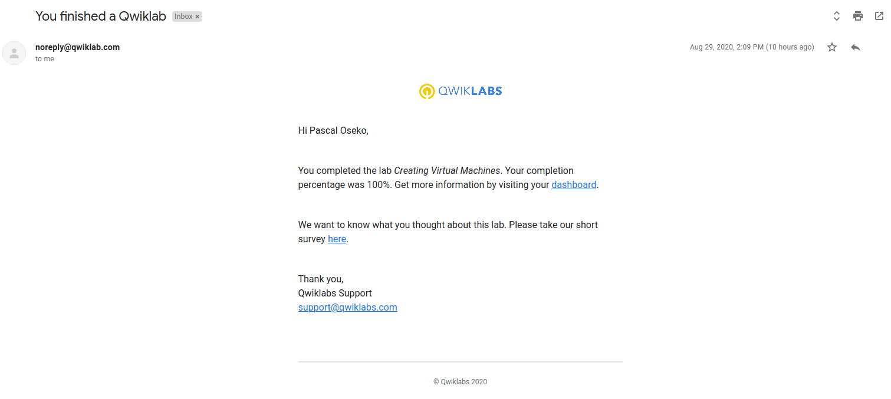
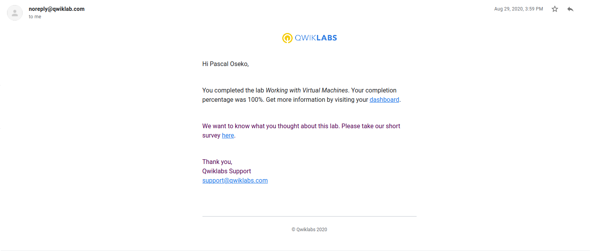
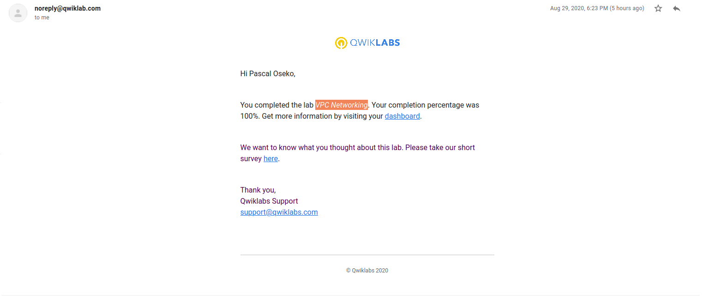
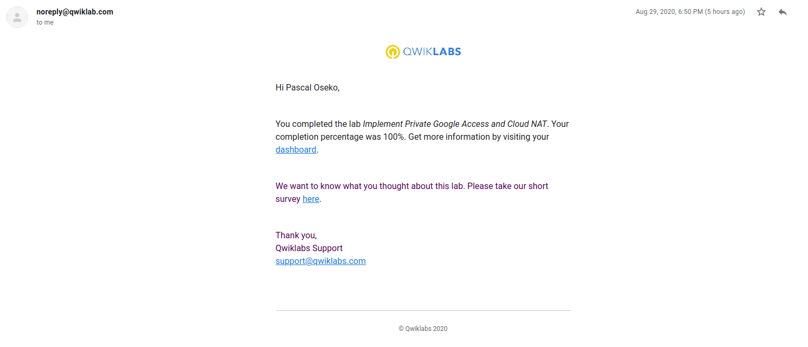
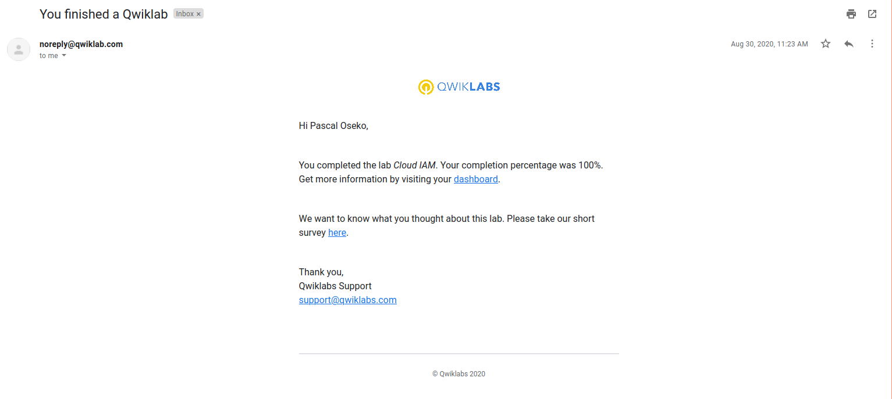
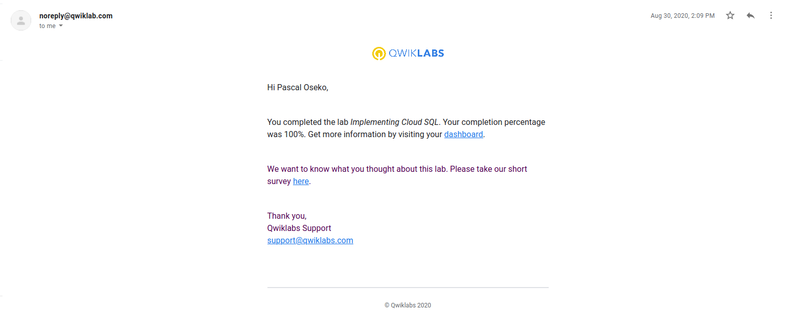
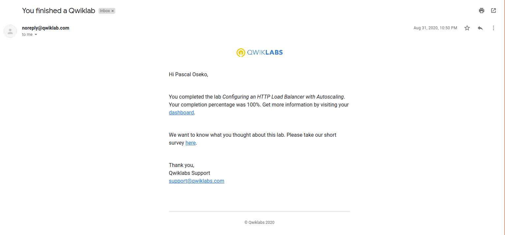
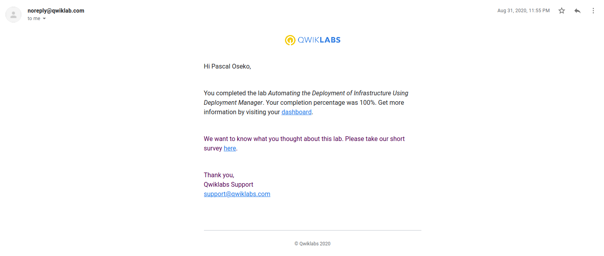

# Challenge 1

## Course: Essential Google Cloud Infrastructure: Foundation
### Module: Virtual Machines

- Creating Virtual Machines

  
  
- Working with Virtual Machines
  
  
### Module: Virtual Networks

- VPC Networking
  
  
- Implement Private Google Access and Cloud NAT
  
  
## Course: Essential Google Cloud Infrastructure: Core Services
### Module: Cloud IAM
- Cloud IAM
  
- Implementing Cloud SQL
  
  
### Module: Resource Management
- Examining Billing data with BigQuery
  
  
### Module: Resource Monitoring
- Resource Monitoring
  
- Error Reporting and Debugging
  
  

## Course: Elastic Google Cloud Infrastructure: Scaling and Automation
## Module: Load Balancing and Autoscaling
- Configuring an HTTP Load Balancer with Autoscaling
  
- Configuring an Internal Load Balancer 
  

## Module: Infrastructure Automation
- Automating the Deployment of Infrastructure Using Deployment Manager
  